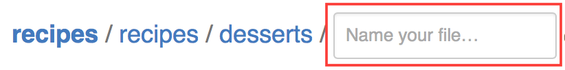
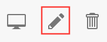

## License
These recipes are licensed [Creative Commons Attribution 4.0 International License](http://creativecommons.org/licenses/by/4.0/)

## Structure
* Breakfast
    * Smoothies
* Appetizer
* Salads
    * Dressings & vinagrettes
* Woks & pans
* Soups & stews
* Sweets 


## Contributing recipes
### To create a new recipe

1.  Navigate to the recipes directory, and then the category where you
    want to add a recipe.
    
1.  Click the "new file" button at the top right:<br />

1.  In the "name your file..." box type the name of the recipe. <br />  
This should be:
    * brief
    * all in lower case
    * use `_` to separate words
    * end in `.md` 

1.  Enter the recipe in the large edit box. Most recipes have three sections:
 
    ```
    # This is the title
    
    * Each ingredient is 
    * listed on
    * a line that starts with an asterisk
    
    The cooking procedure is listed below.
    
    #### Inspired by: (optional)
    * Each source is listed here
    
    #### Pendings: (optional)
    * Each TODO or furhter thought goes here if necessary
    ```
    
    You can click `Preview Changes` to check that everything is formatted correctly.

1.  Write "Adding new recipe" in the (small) first box under 
    "commit changes". Leave the (large) second box blank.
  
1.  Click the "commit changes" button: <br />  

1.  The recipe will show up on <https://github.com/andreamalhera/committed_meals/tree/master/recipes> in a few minutes.
    Don't worry if something goes wrong, github keeps a copy of every change,
    so there's nothing you can do that can't be undone.

### To edit a recipe

1.  Make sure you're logged in to github.
 
1.  Navigate to the `recipes` directory, then the category, then click on the
    name of a recipe. 
    
1.  Click the edit button <br />

1.  Make the changes.
    
1.  Write a brief description of the change in the (small) first box under 
    "commit changes". Leave the (large) second box blank.
  
1.  Click the "commit changes" button: <br /> 

1.  The changes will show up on <https://github.com/andreamalhera/committed_meals/tree/master/recipes> in a few minutes.
    Don't worry if something goes wrong, github keeps a copy of every change,
    so there's nothing you can do that can't be undone.
    
## Pendings
* TODO: Add recipes from: https://drive.google.com/file/d/1kAtf94mUsLOCO4gIeD0WJWZGu_byKbwD/view
* TODO: Add portion measurements to recipes
* TODO: Add "Goes well with section" 
* TODO: Add some sort of labels: e.g. {"bowls", \<origin\>, \<ingredient season\>, \<prep duration\>, "good for meal prep", etc.}
